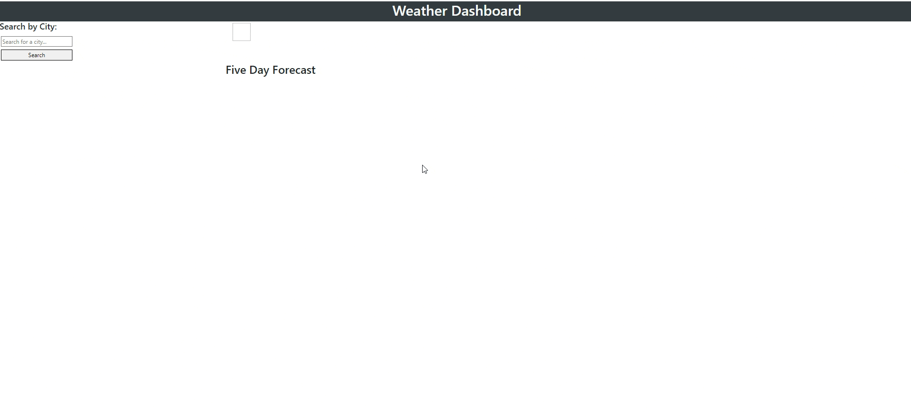

# Simply Weather


## Table of Contents


- [Description](#description)
- [Technologies](#technologies)
- [Deployed Link](#link)
- [Usage](#usage)
- [User Information](#userinformation)
- [Credits](#credits)
- [License](#license)

## Description
A very lean, and 90's nostalgic weather dashboard. Simply search by city name and you'll be returned current weather data for today as well as the five day forecast.

## Technologies Used

- HTML
- CSS
- Bootstrap
- Javascript
- jQuery

## Deployed Link

[Simply Weather](https://mtwence.github.io/simply-weather/)

## Usage

### Website Demo



### Code Snippets

#### Form Submit Function
```ruby
// Runs when form is submitted 
form.on("submit", function (x) {
    x.preventDefault();
    var searchInput = search.val();
    console.log(searchInput);
    fetchData(searchInput);
    //    for when searching with no input 
    if (searchInput === "") {
        return;
    }
    // add search to search history array and add to local storage 
    if (!searchHistory.includes(searchInput)) {
        searchHistory.push(searchInput);
        localStorage.setItem("searchHistory", JSON.stringify(searchHistory));
        search.val("");
    }
```
This function is called when your city search is submitted, which pushes your search to an array, and then saves to local storage.
<br>

#### Fetch from Weather API
```ruby
var fetchData = function fetchCurrentWeather(searchInput) {
    // Turn city into lat & lon 
    fetch("https://api.openweathermap.org/geo/1.0/direct?q=" + searchInput + "&units=imperial&appid=" + apiKey)
        // get response and turn it into json objects
        .then(function (res) {
            // console.log(res.json());
            return res.json();

        }).then(function (data) {
            console.log(data);
            currentCity.text(data[0].name);
            var cityLon = data[0].lon;
            var cityLat = data[0].lat;

            fetch("https://api.openweathermap.org/data/2.5/onecall?lat=" + cityLat + "&lon=" + cityLon +
                "&exclude=hourly,minutely,alerts&units=imperial&appid=" + apiKey)
                .then(function (res) {
                    return res.json();
                }).then(function (data) {
                    console.log(data);
                    displayData(data);
                })

        })
}
```
This fetches the json object of weather data from the OpenWeather API.
<br>

##### Five Day Forecast For Loop
```ruby
for (var i = 1; i < 6; i++) {
        var card = $("<div>").addClass("card").appendTo(forecast);
        var date = moment.unix(data.daily[i].dt).toDate();
        var time = $("<h6>").text(moment(date).format("MMMM Do, YYYY")).appendTo(card);
        var img = $("");
        var icon = data.daily[i].weather[0].icon;
        img.attr("src", "https://openweathermap.org/img/wn/" + icon + "@2x.png");
        img.addClass("forecast-icon")
        img.appendTo(card);
        var temp = $("<h6>").text("temp: " + data.daily[i].temp.day + "°").appendTo(card);
        var humidity = $("<h6>").text("humidity: " + data.daily[i].humidity + "%").appendTo(card);
        var wind = $("<h6>").text("wind: " + data.daily[i].wind_speed + "mph").appendTo(card)
    }
}
```
This for loop which is nested in the function to display weather data on the page, dynamically adds forecast cards of weather data to the html file. 
<br>

## User Information

### **Michael Wence**
[LinkedIn](https://www.linkedin.com/in/michael-wence/) |
[GitHub](https://github.com/mtwence)

## Credits

UCB - Coding Bootcamp
Daniel Stefani - 5day forecast for loop


## License

[](https://opensource.org/licenses/MIT)

---

© 2022 Michael Wence. All Rights Reserved.